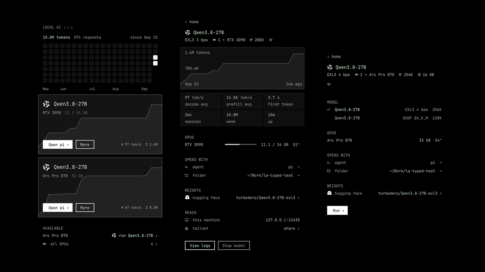

# Local AI for Omarchy

One bar button that runs the validated local model for your GPU and opens any
coding agent on it. You see the model name, Start/Stop, an agent picker, and a
Tailscale share toggle. Everything else is automatic and refuses out loud:
hardware match, download, launch, acceptance, agent launch, rollback.



[Watch the demo](media/demo.mp4): from the bar, Start loads Qwen3.8-27B on an Intel Arc Pro B70; then pi, opencode, codex, claude, crush, omp, copilot and grok each do one step of the same fix on that model. How it was recorded is in [`demo/`](demo/README.md).

## Install

```bash
omarchy plugin add https://github.com/0xSero/omarchy-local-ai.git --enable
```

Then click the bar icon and press **Start**. The first start downloads the
model for your card; later starts are seconds.

Requirements: Docker with the NVIDIA container toolkit (or an Intel Arc Pro
B70 with its render nodes), `jq`, `curl`, `flock`. Optional: `tailscale` for
sharing, `hf` for faster downloads (the recipe's own image downloads otherwise).

## Remove

```bash
omarchy-local-ai unload          # stops the model, keeps downloads
omarchy plugin remove sero.local-ai
rm -rf ~/.cache/omarchy/local-ai  # optional: the downloaded weights
rm -rf ~/.local/state/omarchy/local-ai
```

The plugin never edits files you own. Agents get the local endpoint only when
launched from the panel; typed in a terminal they keep their own provider.

## What runs

- **One recipe per GPU**, from `recipes.json`, vendored from the
  [local-ai registry](https://github.com/0xSero/local-ai-registry) and
  validated on that exact card. Digest-pinned image, pinned weights revision,
  bridge networking, no extra capabilities; the plugin re-checks all of that
  on every start and refuses anything else.
- **Two containers** the plugin owns and labels: the engine (TabbyAPI,
  SGLang, vLLM, or llama.cpp) on a private network, and the
  [gateway](https://github.com/0xSero/local-ai-images) on `127.0.0.1:12434`,
  which serves OpenAI chat, Anthropic Messages, and OpenAI Responses so every
  agent talks to one endpoint.
- **Acceptance** before "ready": the served model matches, all three dialects
  answer, tool calls work when the recipe claims them, and decode speed is not
  a CPU fallback. Failure rolls back to the previous model.
- **Agents**: pi, omp, opencode, ori, claude, codex, grok, agy, hermes,
  copilot, crush, launched through `omarchy-launch-tui` with the endpoint,
  key, and model in the environment. An agent whose dialect failed
  acceptance is hidden.
- **GPU**: the card shows what was detected. One card is a line; more than
  one is a picker. The default is the largest card that has a validated
  recipe; `omarchy-local-ai gpu <backend:index>` (or the picker) pins another,
  and a pinned card with no recipe says so rather than silently using a
  different one. `gpu auto` returns to the default.
- **Share**: the gateway's port published on this machine's tailnet address
  (`http://<host>.<tailnet>.ts.net:12434`), keyed. One click, no `tailscale
  serve`, no password: the stateless gateway restarts with the extra port
  binding. The key is generated on first start into
  `~/.local/state/omarchy/local-ai/gateway.key` (mode 0600) and lives only
  there: never in the ledger, the snapshot, or the log. The card shows the
  URL and the key file's path; `omarchy-local-ai share --key <value>`
  replaces it. A `HF_TOKEN` in the environment reaches the downloader by
  name only and is never written anywhere.

## Commands

```
omarchy-local-ai snapshot               refresh and print the state the panel renders
omarchy-local-ai load                   download if needed, then start
omarchy-local-ai unload                 stop; keep downloads
omarchy-local-ai open-agent [name]      open an agent on the running model
omarchy-local-ai share [--key <value>]  toggle tailnet sharing, or replace the key
```

State: `~/.local/state/omarchy/local-ai/` (`snapshot.json`, `ledger.json`,
`log`). Weights: `~/.cache/omarchy/local-ai/models/` or the shared Hugging
Face cache, whichever the recipe mounts.

## Development

```bash
bash test/all        # isolated state, shimmed docker/curl/tailscale; no GPU needed
make sync   # regenerate recipes.json from ../registry (this repo)
```

`recipes.json` carries the registry commit it was exported from; CI fails if
the file and the commit disagree.

## License

MIT. Container images are pinned by digest and documented in
`recipes.json`; self-built images carry a build attestation you can verify
with `gh attestation verify`.
