# Local AI for Omarchy

Run the model validated for your GPU and open a coding agent on it.

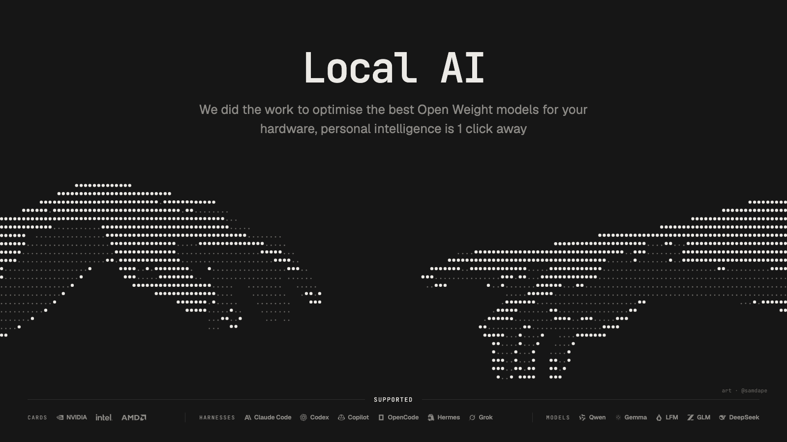

## Screens

Every picture is the real panel, rendered headless from the snapshot of a machine with 2× RTX 3090 and 2× Arc Pro B70 (the 3090's model as it ran earlier that day). To show states that machine was not in, some screens change that snapshot: a first run, downloading, loading, a crash, a tailnet share, both or four 3090s free, and a card with no tested model.

| Home | Hovering a day | A first run |
|---|---|---|
| 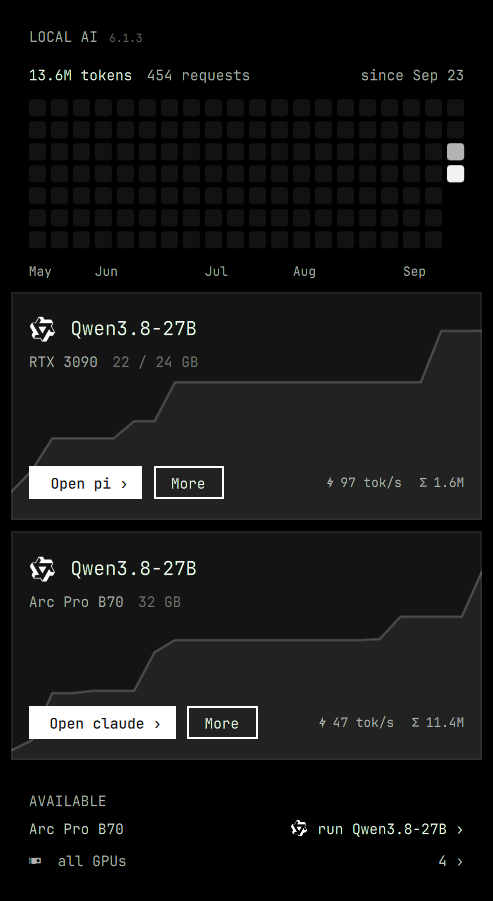 | 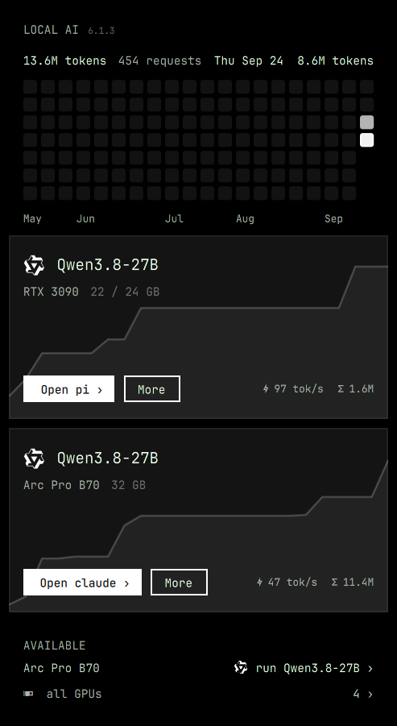 | 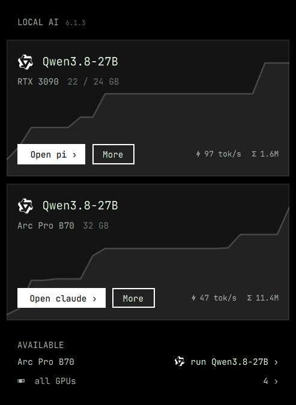 |

Home: your tokens and requests over the last 20 weeks, running models as cards, then the free cards; the rest are one "all GPUs" away.

| A running model | Its agent | Its folder | Shared on the tailnet |
|---|---|---|---|
| 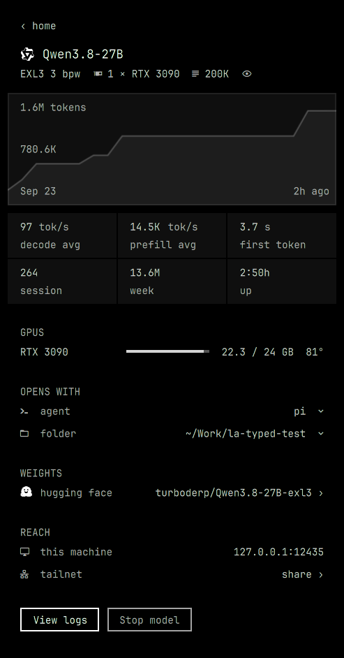 | 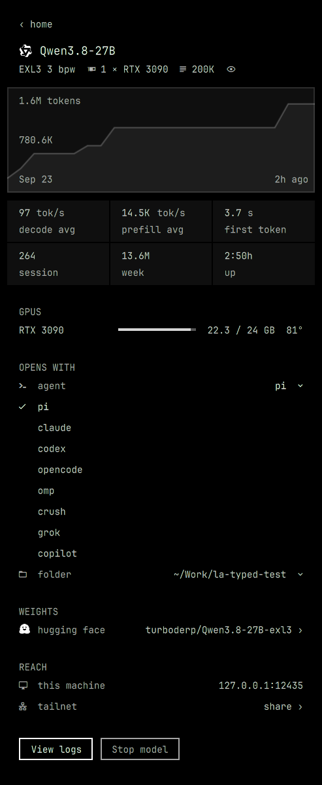 | 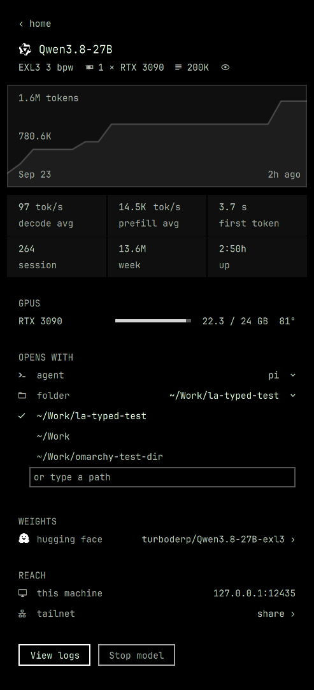 | 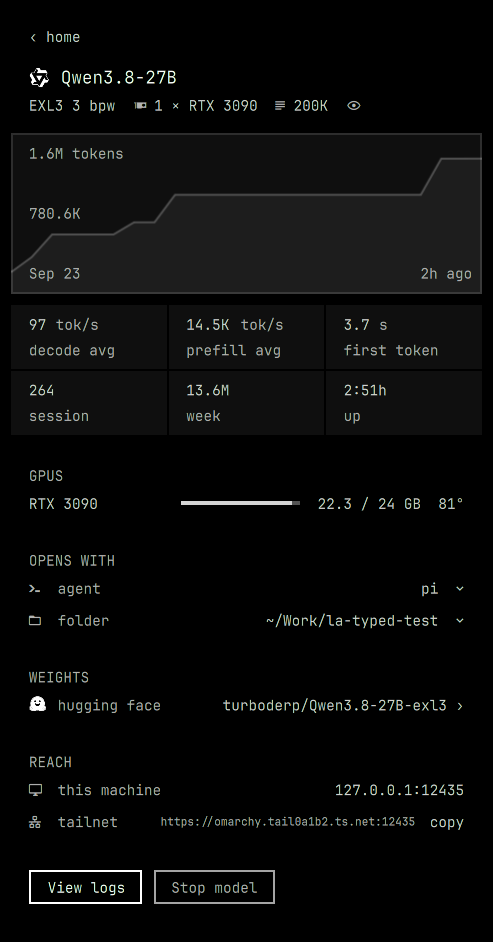 |

| A card's Config | Choosing another model | Downloading | Loading |
|---|---|---|---|
| 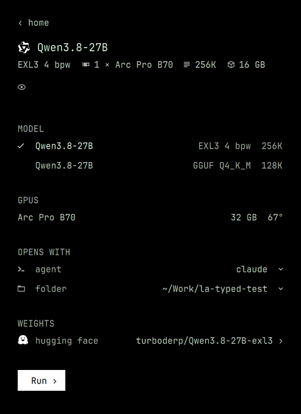 | 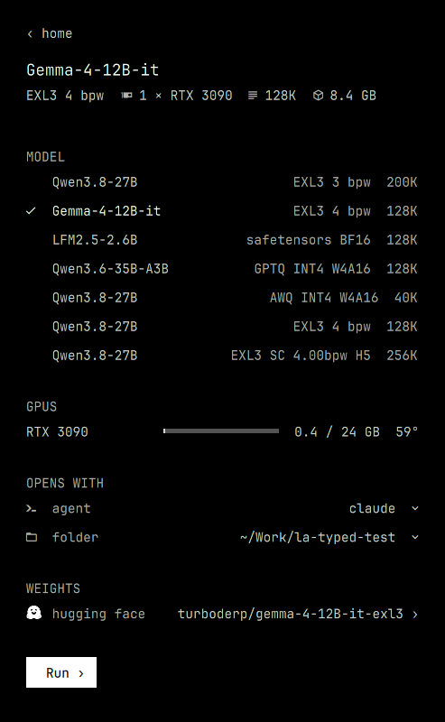 | 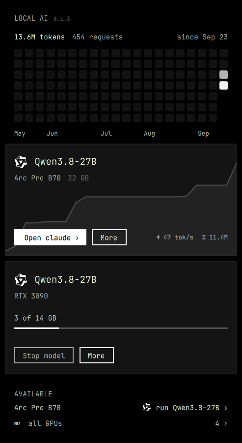 | 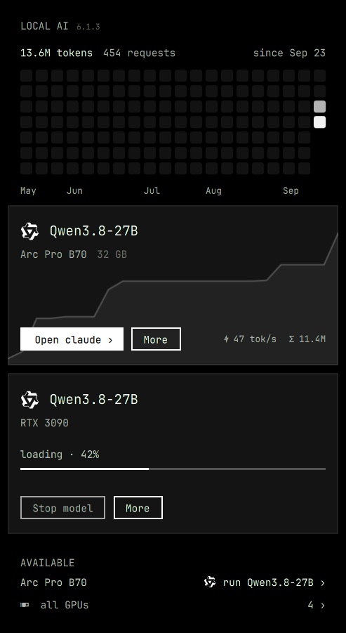 |

| Two free cards as a group | A group's page | Four cards of a kind |
|---|---|---|
| 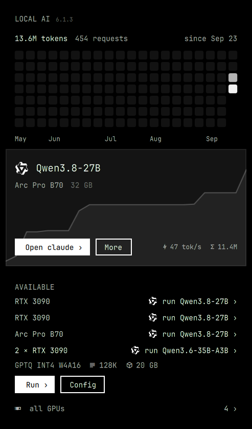 | 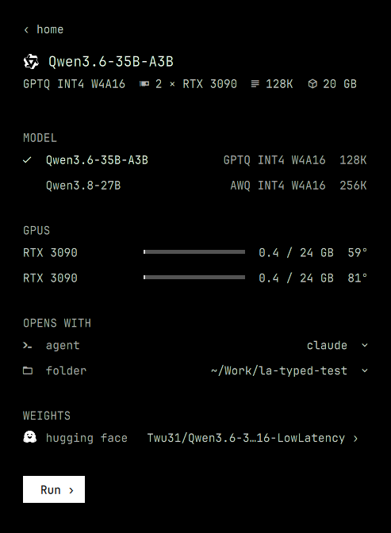 | 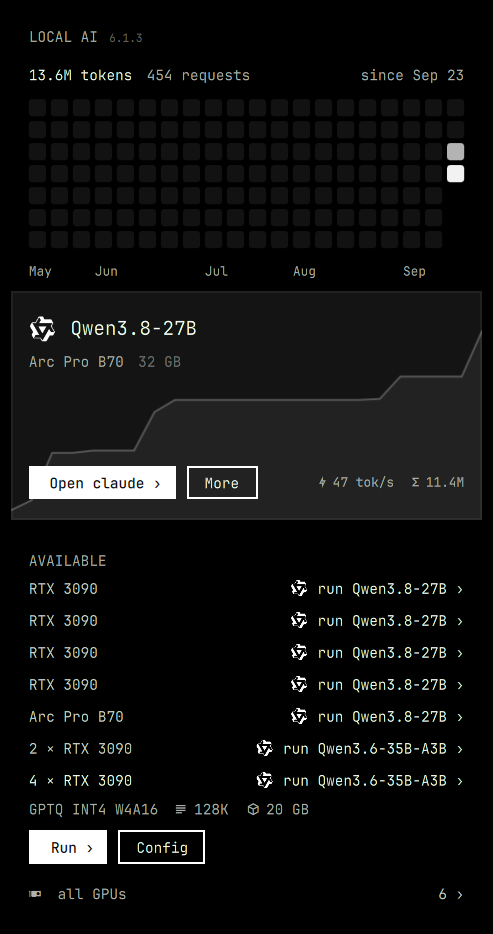 |

| A crashed card | All GPUs | Coming soon |
|---|---|---|
| 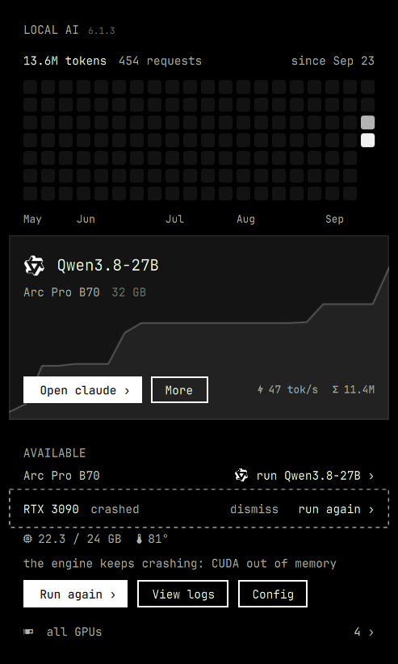 | 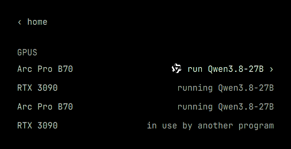 | 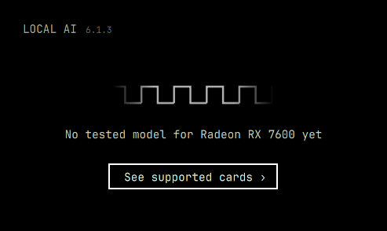 |

## Install

```bash
omarchy plugin add https://github.com/0xSero/omarchy-local-ai --enable
```

Open Local AI in the bar and click **Set up Local AI**. It opens a terminal for your password and setup progress, turns on Omarchy's Sudoless Docker (it explains what that means and asks first), makes you the tailnet's operator when none is set so a model can be shared, and configures NVIDIA container support when needed. Return to the panel when setup finishes; the current login gets a temporary Docker socket ACL, so no logout or reboot is needed. If Docker recreates its socket before your next login, the panel asks you to log out and back in once. Setup refuses to restart Docker while containers are running.

Setup is the only password Local AI asks for, once per machine: starting, stopping, sharing, refreshing and removing never ask, and plugin updates never ask for setup again. Sudoless Docker is root-equivalent, as Omarchy's own warning says; turn it off in Setup > Security.

### What setup runs as root

`bin/omarchy-install-ai-local` runs only when you click **Set up Local AI**; adding or updating the plugin never runs it. It asks for your password once (`sudo -v`), then:

- NVIDIA only, when Docker has no `nvidia` runtime: installs `nvidia-container-toolkit` with `omarchy-pkg-add`, runs `nvidia-ctk runtime configure --runtime=docker` (which edits Docker's daemon configuration) and `systemctl restart docker`. It stops without changing anything if containers are running.
- Runs Omarchy's `omarchy-setup-security-sudoless-docker`, which explains the change and asks first.
- Until your next login, `setfacl` gives your account read and write access to the Docker socket.
- When Tailscale is installed and has no operator or you are the operator, `tailscale set --operator=$USER`, so sharing needs no prompt.
- Removes the polkit policy and rule files that earlier versions wrote for this user, then `systemctl reload polkit`.

## Requirements

- Omarchy with the Quattro shell and its bar. Local AI calls Omarchy's own commands: `omarchy-sudo-docker`, `omarchy-setup-security-sudoless-docker`, `omarchy-pkg-add`, `omarchy-hw-nvidia`, `omarchy-launch-tui`, `omarchy-launch-browser`, `omarchy-notification-send` and `omarchy-cmd-present`.
- Docker, `jq`, `curl`, `flock` and `sha256sum`.
- A supported GPU (below). NVIDIA needs the driver and `nvidia-smi`; setup adds the container toolkit. AMD needs ROCm's `amd-smi`.
- Optional: Tailscale, to share a model; a Hugging Face token in `~/.cache/huggingface/token`, used for downloads when it exists.
- Network access to `huggingface.co` (weights), `ghcr.io/0xsero` (the engine and gateway images, pinned by digest), and `api.github.com` and `raw.githubusercontent.com` (**Refresh models**).

## What it does

- **Validated models per card, or one across several.** `recipes.json` holds, for each of 40 card kinds, every recipe accepted on that exact card or across 2 or 4 of them in [local-ai-registry](https://github.com/0xSero/local-ai-registry): download, load, a correctness check and speed at several context lengths. EXL3 weights on SGLang or vLLM come first and are recommended; a card's Config lists the rest. A card without a recipe shows Coming soon and links the [supported list](https://github.com/0xSero/local-ai-registry/blob/main/supported/README.md).
- **What the machine needs.** A recipe that keeps experts in system RAM or reads from disk while it serves (Qwen3.8-Flash-Next on a 3090 or a B70) says how much free RAM and disk it needs and whether the models folder must be on NVMe; it is offered only on a machine that has them, and Config says what is missing.
- **Weights** are downloaded as you, from the pinned revision, and every file's size and sha256 is checked against the Hub before it is used. A matching copy in your Hugging Face cache is reused.
- **Containers.** The engine runs on a private network with no published port and `no-new-privileges`. A keyed gateway runs as you on `127.0.0.1`, speaks the OpenAI, Anthropic and Responses APIs, and logs one line per answer; the tokens, speeds, charts and the activity grid on Home come from that log, summed once per new line rather than on every refresh.
- **Agents.** pi, Claude Code, Codex, OpenCode, omp, Crush, Grok, Copilot and Hermes open in a terminal, in the folder you pick, pointed at the gateway. Nothing in their own config is touched. The last agent and folder you picked become the default.
- **Share** a running model on your tailnet with `tailscale serve` (tailnet only, still keyed). **Stop sharing** on its page removes that share. Tailscale must be running and logged in. Setup preserves another account’s operator; ask that account to manage sharing. A failed unshare is logged and does not prevent stopping the model.

Supported: NVIDIA RTX 30, 40 and 50 series, RTX A6000, RTX Ada and RTX Pro Blackwell, Intel Arc Pro B70, and AMD Instinct MI300X and Radeon RX 6800 XT (with ROCm's `amd-smi`).

## From a shell

```bash
bin/omarchy-local-ai setup                    # one-time machine setup
bin/omarchy-local-ai registry                 # refresh the validated catalog
bin/omarchy-local-ai forget <recipe>          # remove stopped managed weights
bin/omarchy-local-ai snapshot                 # what the card draws, as JSON
bin/omarchy-local-ai run <recipe> <gpu>[,<gpu>] # e.g. run qwen38-27b-exl3-3bpw-rtx3090-sglang-tp1 nvidia:0
bin/omarchy-local-ai stop <recipe>
bin/omarchy-local-ai open <recipe>            # the chosen agent on it, in a terminal
bin/omarchy-local-ai set agent|folder <value> [recipe]
bin/omarchy-local-ai share <recipe> [off]
bin/omarchy-local-ai log
```

Each running model answers on `http://127.0.0.1:<port>/v1` (ports from 12434); the key is in `~/.local/state/omarchy/local-ai/gateway.key`.

## Remove

`bin/omarchy-remove-ai-local` stops this user’s managed models and deletes their containers, engine images, weights and settings. Then `omarchy plugin remove sero.local-ai`.

## Files

| File | Role |
|---|---|
| `bin/omarchy-local-ai` | The backend, one bash file |
| `Model.js` | Pure functions: the snapshot in, the view out |
| `Panel.qml` | Draws the view and runs the backend's verbs |
| `recipes.json` | The vendored recipes, one card kind per line (`make sync`) |

`docs/design.md` has the design and `test/all` runs the tests.

### Container boundary

Images are pinned by SHA-256. The gateway runs as the calling user, with no
Linux capabilities, a read-only root filesystem, a bounded temporary directory
and external DNS disabled. Docker service discovery still resolves the engine;
usage records remain writable in their dedicated directory. Existing containers
receive these restrictions when stopped and started again.

Model engines still have writable container filesystems and outbound network
access. Digest pins and build attestations establish image identity; they do
not make untrusted code safe. Engine restrictions need per-engine hardware
validation before rollout. Disabling gateway DNS does not block outbound IP
connections.

### Refresh and remove models

Use **Refresh models** at the bottom of Local AI to fetch the latest published
registry for your GPUs without reinstalling the plugin; the catalog lives in your
cache (`~/.cache/omarchy/local-ai`). Downloads are pinned to a registry commit,
validated before an atomic replacement, and failures keep the previous catalog.
Refreshing does not stop running models or download model weights. Offload
recipes are offered only when their RAM, disk and storage requirements fit.

Choose a GPU's **Config**, select a model, then **Run** to download and start it.
**Remove download** deletes that model's managed weights after it is stopped;
shared weights in use by another managed model are protected. The recipe stays
available to download again. Files in your separate Hugging Face cache are kept,
so hard-linked files there may continue to occupy disk space.

The equivalent commands are `omarchy-local-ai registry` and
`omarchy-local-ai forget <recipe>` (or the plugin's `bin/omarchy-local-ai`).

## License

[MIT](LICENSE). The agent and GPU-maker logos in `preview.png` belong to their owners and identify compatibility only; their sources and terms are in [docs/preview/logos/README.md](docs/preview/logos/README.md).
